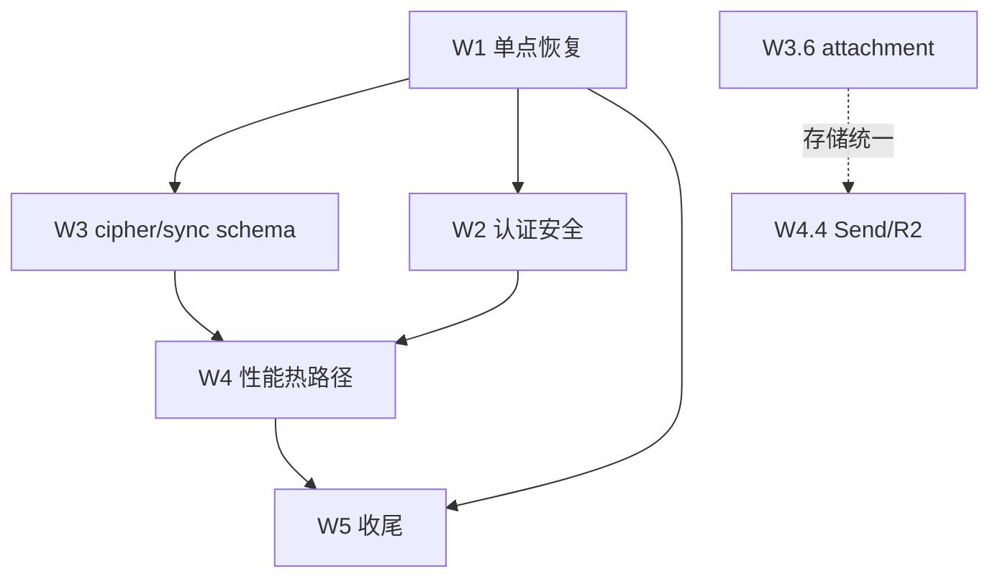

# warden-worker 修复计划

综合 `REPORT.md`（安全/性能静态审查）与 `REQUIRE.md`（与官方 bitwarden/server API 差异）制定。日期：2026-07-28。**本文件仅规划，暂不执行。**

> **部署前提**：纯个人使用，无公开注册、无多用户、无组织/admin 场景。威胁模型相应收窄：账号枚举、改邮箱劫持、邮箱验证、admin-request 伪造等对外风险不成立，相关条目已删除或降级。

## 0. 两份报告的关系

- `REPORT.md`：偏**安全/性能**，按严重度（C/H/M/L）分级，定位 Cloudflare Workers 运行约束下的真实风险。
- `REQUIRE.md`：偏**协议兼容**，按客户端破坏度（P0/P1/P2）分级，定位与官方服务端的 API 差异。
- 大量条目重叠（同一缺陷两份报告各从一侧描述）。本计划去重后按**修复波次**组织，每条标注来源（`[Rpt C1]` / `[Req #9]` 等）。
- 修复顺序原则：**单点高杠杆优先 > 安全漏洞 > 协议补全 > 性能 > 收尾**。与两份报告各自的"建议顺序"基本一致，仅在性能与协议补全之间按"先恢复核心可用性、再压成本"调整。

## 1. 波次总览

| 波次 | 主题 | 条目数 | 预期收益 | 阻塞下游 |
| W1 | 单点恢复核心流程 | 5 | sync / 改密改邮箱 / 2FA 列表 / Send 编辑 / 2FA 状态 立即可用 | W3 依赖 W1 的 schema |
| W2 | 认证安全闭环 | 5 | 消除会话固定 / 重放 / 明文种子 / admin 伪造 | — |
| W3 | cipher 与 sync schema 补全 | 6 | 客户端反序列化通过、附件/集合可见 | — |
| W4 | 性能热路径 | 4 | sync / WebAuthn / usage / Send 文件 不再放大 | — |
| W5 | 其余 Medium/Low + 协议补全 | 余项 | 兼容性、成本、死代码清理 | — |

每波内部条目**可并行**（不同文件/子系统），跨波**串行**（W1 先合入再开 W2，避免合并冲突）。建议每波一个 PR，独立可回滚。

---

## W1 — 单点恢复核心流程（第一波，最高杠杆）

目标：用最小改动恢复客户端最核心的登录/同步/2FA/Send 路径。每条都是单点修复，互不依赖。

### W1.1 — `object: "default_object"` → `"cipher"`
- 来源：`[Req #9]`（P0，单点破坏同步）
- 位置：`src/models/cipher.rs:186`
- 问题：DB 反序列化路径的 cipher `object` 字段恒为 `"default_object"`，客户端按 `object` 分发反序列化器 → cipher 被丢弃或 sync 整体失败。影响 `/api/sync`、`PUT /delete`、`PUT /restore`。
- 改法：`object: "cipher".to_string()`。一行。
- 验收：`/api/sync` 响应里每条 cipher `object == "cipher"`；客户端能列出保险箱。
- 风险：无。这是纯 bug。

### W1.2 — 改密/改邮箱 PUT → POST
- 来源：`[Req #6]`（P0，功能完全不可用）
- 位置：`src/router.rs:121,123`
- 问题：客户端发 POST，warden 注册 PUT → 405。
- 改法：`put(...)` → `post(...)`，两条。**保留 PUT 别名**与否待定（见 W5 死代码清理）；本波只加 POST。
- 验收：客户端改密、改邮箱返回 200。
- 风险：若有外部脚本依赖 PUT 需同步通知；项目无此调用方。

### W1.3 — `GET /two-factor` 响应 schema 重写
- 来源：`[Req #17]`（P0，客户端无法显示 2FA 列表）
- 位置：`src/handlers/two_factor.rs:106-125`
- 问题：warden 返回 `{enabled, providers:[int]}`，官方返回 `{object:"list", data:[{enabled, type, object:"twoFactorProvider"}]}`。
- 改法：重写序列化为 `{object:"list", data:[{enabled, type, object:"twoFactorProvider"}]}`，`type` 用 provider 枚举值（Authenticator=0, WebAuthn=7 等）。
- 验收：与官方 schema 字段名/嵌套一致；客户端显示已启用 2FA 列表。
- 依赖：W1.5（`two_factor_enabled` 真值）同波完成更稳，但可独立先合。

### W1.4 — 补 `PUT /sends/{id}`（编辑 Send）
- 来源：`[Req #29]`（P0，编辑 Send 完全不可用）
- 位置：`src/router.rs:178-197`、`src/handlers/sends.rs`
- 问题：缺整条编辑端点。
- 改法：新增 `put(sends::put_send)`，handler 复用现有 create 校验逻辑（名称/密钥/到期/访问次数），按 `id + user_id` 更新。**不加** remove-password / access（W5）。
- 验收：客户端编辑 Send 名称/笔记后 `/api/sync` 返回新值。
- 风险：复用 create 校验时注意 `encrypted_for`（见 W3.2）。

### W1.5 — `two_factor_enabled` 查全 provider
- 来源：`[Req #14]`（P0，安全降级）
- 位置：`src/handlers/sync.rs:94`、`src/core/two_factor.rs`
- 问题：仅查 authenticator，启用 WebAuthn/Email 2FA 的用户被报 `false`，客户端不要求 2FA。
- 改法：新增 `is_two_factor_enabled(db, user_id) -> bool`，查所有已配置 provider（authenticator + webauthn，后续 W5 扩展 email/yubikey）；sync 与 token 响应统一调用。
- 验收：仅启用 WebAuthn 的账号 `twoFactorEnabled == true`。
- 依赖：与 W1.3 共用 provider 枚举，建议同一 PR。

**W1 出口标准**：核心客户端（桌面/移动）能完成登录 → sync 显示保险箱 → 改密改邮箱 → 查看/编辑 2FA → 编辑 Send。合入后开 W2。

---

## W2 — 认证安全闭环（第二波）

目标：消除会话固定、重放、越权、明文种子。这是 REPORT.md 的 H1–H5 + REQUIRE.md #2/#3/#4/#5/#24 的合集。

### W2.1 — JWT 绑定 security stamp
- 来源：`[Rpt H1]` + `[Req #2]`
- 位置：`src/core/auth.rs:12-25`、`src/handlers/identity.rs`（refresh 分支）、`src/handlers/accounts.rs:584`
- 问题：`Claims` 无 `security_stamp`/`jti`/session version；改密改邮箱更新了 `users.security_stamp` 但提取器与 refresh 不校验 → 旧 refresh token 30 天内仍可换发。
- 改法：
  1. `Claims` 加 `security_stamp: String`（或 `sid`/session version）。
  2. 签发 access/refresh 时写入当前 `users.security_stamp`。
  3. `Claims` 提取器 + refresh 分支查库比对，不匹配 → `Unauthorized`。
  4. 改密/改邮箱/`post_security_stamp` 后 bump stamp。
- 验收：改密后旧 refresh token 换发被拒；新 token 正常。
- 风险：所有已签发 token 失效（一次性强制重登）。可接受。
- 依赖：无。但 W2.2/W2.3 同波，建议同一 PR 统一认证改动。

### W2.2 — auth-request 登录消费 + 补 2FA
- 来源：`[Rpt H2]` + `[Req #3]` + `[Req #56]`
- 位置：`src/handlers/identity.rs:369-389`、`src/handlers/devices.rs:49,54-84,640-771`
- 问题：批准后不消费 `authentication_date`，access code 可重放；且注释明写 "bypasses 2FA"。
- 改法：
  1. 登录成功时条件更新 `authentication_date = now WHERE authentication_date IS NULL`，影响 0 行 → 拒绝（已消费）。
  2. 受信设备登录若账号启用 2FA，仍要求 2FA 验证（除非该 device 已 `is_trusted` 且在信任窗口内——需先实现 trust 流，否则默认要求 2FA）。
- 验收：同一 auth-request 第二次登录被拒；启用 2FA 账号经 auth-request 登录仍需 2FA。
- 风险：trust 流未实现前，受信设备登录体验退化（每次都要 2FA）。可接受，因 W5 才补 trust。

### W2.3 — WebAuthn passwordless 一次性 challenge + 强制 UV
- 来源：`[Rpt H4]` + `[Rpt H5]` + `[Req #4]`
- 位置：`src/core/webauthn.rs:986-1006,1031-1043,1290`
- 问题：challenge 不消费（5 分钟 JWT TTL 内可重放）；不检查 `flags & 0x04`（UV），丢失 authenticator 即可登录。
- 改法：
  1. passwordless challenge 存服务端 nonce/jti，验证时原子删除（`DELETE ... WHERE nonce=? RETURNING` 或先 SELECT 再 DELETE 于事务内）。
  2. challenge options 设 `userVerification: "required"`。
  3. 验证时强制 `flags & 0x04 != 0`，缺失 → `Unauthorized`。
- 验收：截获的 passwordless 提交第二次被拒；无 UV 的 authenticator 被拒。
- 依赖：与 W2.2 的 2FA 逻辑共用 provider 查询。

### W2.4 — TOTP 种子强制加密
- 来源：`[Rpt H3]`
- 位置：`src/core/two_factor.rs:97-106`、调用方 `env.secret("TWO_FACTOR_ENC_KEY").ok()`
- 问题：密钥缺失时 `plain:{secret}` 明文入库，`ok()` 吞错。
- 改法：生产路径（`env.var("ENV") == "production"` 或始终）要求 `TWO_FACTOR_ENC_KEY` 存在，缺失 → `AppError::Internal`；删除明文回退分支。本地 dev 可用环境变量显式 opt-in 明文。
- 验收：无密钥时 enable authenticator 返回 500 且不入库；有密钥时正常加密。
- 风险：已有明文种子需迁移脚本（一次性 backfill：读 `plain:` 前缀 → 加密 → 回写）。迁移脚本随 PR 附带。

### W2.5 — `/api/auth-requests/admin-request` 直接 404
- 来源：`[Req #24]`
- 位置：`src/router.rs:83-94`、`src/handlers/devices.rs:511-604`
- 问题：路由到匿名 handler，任何人可伪造 admin 审批请求。
- 改法：个人部署无组织/admin 场景，直接移除该路由（或 handler 返回 404）。删 `admin_request` handler 死代码。
- 验收：`POST /api/auth-requests/admin-request` 返回 404。

**W2 出口标准**：改密后旧会话失效；auth-request 与 passwordless 不可重放；2FA 不被绕过；TOTP 种子不明文；admin-request 返回 404。

---

## W3 — cipher 与 sync schema 补全（第三波）

目标：让客户端反序列化通过、附件/集合可见、sync Profile 真实化。这是 REQUIRE.md #43/#45/#13/#51 + REPORT.md M4 的合集。

### W3.1 — cipher 响应补 `attachments`/`key`/`data`/`archivedDate`
- 来源：`[Req #43]` + `[Req #44]`
- 位置：`src/models/cipher.rs:195-287`
- 改法：
  1. `data` 字段从 `Option<Value>` 改为按 cipher 类型序列化的结构（或保留 `Value` 但保证非 null）。
  2. 补 `attachments: []`（空数组，附件端点 W3.4 补）、`key: null`、`archivedDate: null`。
  3. `collectionIds` 省略改为 `[]`（见 W5.4，但此处一并改）。
  4. 序列化覆盖 SSHKey/BankAccount 等类型（`[Req #44]`）。
- 验收：客户端按 `data` 读 cipher 内容拿到正确结构；附件字段存在。

### W3.2 — cipher 校验 `encryptedFor`
- 来源：`[Req #10]` + `[Rpt M4 邻近]`
- 位置：`src/models/cipher.rs:349-377`、`src/handlers/ciphers.rs:124-141`
- 改法：写入前校验 `encrypted_for == user_id`（或 owner org），不匹配 → `BadRequest`。import（W3.5）同样校验先于写入。
- 验收：跨用户/旧密文写入被拒。

### W3.3 — `lastKnownRevisionDate` 乐观锁
- 来源：`[Req #11]`
- 位置：`src/models/cipher.rs:376`、`src/handlers/ciphers.rs:144-217`
- 改法：解析 `lastKnownRevisionDate`，更新时 `WHERE updated_at <= ?`，影响 0 行 → `409 Conflict`。
- 验收：并发编辑后输方收到 409。

### W3.4 — `collection_ciphers` 表 + cipher-collection 分配
- 来源：`[Req #12]`
- 位置：`src/handlers/ciphers.rs:88-103`、`sql/schema_full.sql:38-60`
- 改法：
  1. 新增 `collection_ciphers` 表（`cipher_id, collection_id` + 外键）。
  2. cipher 创建/更新时持久化 `collectionIds`。
  3. sync 返回 `collectionIds`。
  4. 补 `PUT /ciphers/{id}/collections`（W3.6 一并）。
- 依赖：schema migration 脚本。

### W3.5 — import 先校验后写入
- 来源：`[Rpt M4]` + `[Req #46]`
- 位置：`src/handlers/import.rs:18-106`
- 改法：
  1. 全部跨记录校验（`encrypted_for`、数量上限 7000/2000）先于任何写入。
  2. 用 `db.batch` 单事务提交 folders + ciphers。
  3. 加数量上限（`[Req #46]`）。
- 验收：超限或校验失败时无部分导入。

### W3.6 — 补 cipher 缺失端点（attachment/share/archive/partial/move/purge）
- 来源：`[Req #45]`
- 位置：`src/router.rs:201-220`
- 改法：补 `GET /ciphers`、`PUT /ciphers/{id}/partial`、`PUT /ciphers/{id}/share`、`PUT /ciphers/{id}/collections`、`POST /ciphers/purge`、attachment 系列、`PUT /archive`/`unarchive`、`PUT /move`。
- 备注：attachment 涉及 W4.4（Send 文件流式化）的同类改造，建议 attachment 内容存 R2、D1 存元数据。**本波先补路由 + handler 骨架，attachment 内容存储与 W4.4 统一决策。**
- 验收：各端点返回官方兼容 schema；404 消失。

### W3.7 — sync Profile 读真实字段
- 来源：`[Req #13]` + `[Req #51]`
- 位置：`src/handlers/sync.rs:90-99,134`、`src/models/sync.rs:3-32`
- 改法：`premium`/`email_verified`/`force_password_reset` 读 `users` 真实字段；补 `domains`（equivalent/exclude）、`policiesNew`、`organizations`、`providers`、`accountKeys`、`verifyDevices`。
- 依赖：`force_password_reset` 需 `users` 表加列（migration）。

**W3 出口标准**：客户端 sync 后能显示完整保险箱（含附件、集合、组织），cipher 各类型反序列化通过，并发编辑有冲突保护。

---

## W4 — 性能热路径（第四波）

目标：消除固定开销放大与 OOM/CPU 风险。按 REPORT.md 性能影响排序。

### W4.1 — `/api/d1/usage` 加鉴权 + 删全表分支
- 来源：`[Rpt C1]` + `[Rpt 性能 #3]`
- 位置：`src/handlers/usage.rs:34-175`、`src/router.rs:224`
- 改法：
  1. handler 加 `Claims` 提取器，强制 `user_id == claims.sub`。
  2. 删除 `user_id == None` 的全表扫描分支。
- 验收：匿名请求 401；`user_id != claims.sub` 403；仅查当前用户。
- 风险：无（纯收紧）。

### W4.2 — WebAuthn / auth-requests 每请求 DDL 下线
- 来源：`[Rpt H8]` + `[Rpt 性能 #2]`
- 位置：`src/core/webauthn.rs:145-222`、`src/handlers/devices.rs:856-870`
- 改法：
  1. 将 `ensure_webauthn_tables` / `ensure_auth_requests_table` 的 DDL 移到 `sql/schema_full.sql` + migration。
  2. 请求路径删除这些调用，或改为 DO 级一次性初始化缓存（首次请求设 flag，后续跳过）。
- 验收：WebAuthn 登录与 auth-request 轮询的 D1 往返数减半以上；功能不变。
- 依赖：schema migration 已含相关表定义则直接删调用。

### W4.3 — `/api/sync` 增量同步
- 来源：`[Rpt H6]` + `[Rpt 性能 #1]`
- 位置：`src/handlers/sync.rs:42-70`
- 改法：
  1. 支持 `?lastSyncDate=` / revision游标，只返回 `updated_at > cursor` 的 folders/ciphers/sends。
  2. 超大 vault 返回可恢复的分段响应（continuation token）。
  3. 短期可先加 `LIMIT` + continuation，长期改 revision游标。
- 验收：二次 sync 仅返回变更；大 vault 不撞 CPU 上限。
- 风险：增量语义需与客户端 `lastSyncDate` 对齐，易出兼容问题。建议先加 LIMIT + continuation，增量游标列为 W4.3b 单独 PR。

### W4.4 — Send 文件流式化 + 硬上限
- 来源：`[Rpt H7]` + `[Rpt 性能 #4]` + `[Req #49]`
- 位置：`src/handlers/sends.rs:490-522,794-814,286-457`
- 改法：
  1. 上传累计实际字节，硬上限 501MB（`[Req #49]`），超限 → `BadRequest`。
  2. 下载按 chunk 流式读取/解码/响应，避免全量入内存。
  3. 长期：内容迁 R2，D1 仅存元数据（与 W3.6 attachment 统一）。
- 验收：50MB 文件下载峰值内存 < 10MB；超限上传被拒。

### W4.5 — 批量 cipher N+1 + sends 列表分页（可并入 W4.3）
- 来源：`[Rpt M2]` + `[Rpt M9]`
- 位置：`src/handlers/ciphers.rs:326,347,367`、`src/handlers/sends.rs:202-209`、`sql/schema_full.sql:174,178`
- 改法：
  1. 批量删除/恢复用 `WHERE user_id=? AND id IN (...)` 分块，校验 ids 上限。
  2. sends 列表加 `LIMIT` + continuation token，补 `(user_id, updated_at DESC)` 索引。
- 验收：批量 1000 项 ≤ 3 次 D1 往返；sends 列表有 continuation。

**W4 出口标准**：sync 不再线性放大；WebAuthn 登录无 DDL 开销；usage 不可被匿名触发；Send 大文件不 OOM。

---

## W5 — 其余 Medium/Low + 协议补全（第五波，收尾）

目标：清理死代码、补兼容性、收敛成本。可与 W4 部分并行（不同文件）。

### W5.1 — 死代码清理
- 来源：`[Rpt L5,L7,L8]` + `[Req #55]`
- 位置：`src/entry.js:156-174`（icons 死分支 + 分桶 hash）、`src/handlers/icons.rs`（不可达）、`src/router.rs:23`、`src/core/crypto.rs`（全 dead_code + iterations=1）、`src/handlers/accounts.rs`（`post_security_stamp`/`update_avatar`/`post_profile` 未挂路由）
- 改法：
  1. 删 Rust icons handler + 路由（entry.js 已代理）。
  2. 删 entry.js icons 死分支；分桶 hash 改 FNV-1a 或整串求和。
  3. `crypto.rs` 若不接入主路径 → 删整文件；若启用 → 复核 PBKDF2 迭代数（当前 1，不安全）。
  4. 未挂路由的 handler 函数：挂路由或删除（`post_security_stamp` 应挂，见 W2.1）。

### W5.2 — 死路由修复
- 来源：`[Rpt M10]`
- 位置：`src/router.rs:41,51` vs `wrangler.jsonc:65`
- 改法：裸 `/accounts/webauthn/assertion-options`、`/accounts/verify-password` 加入 `run_worker_first`，或删路由（带前缀等价版本可用）。

### W5.3 — 业务 `expect()` → `AppError`
- 来源：`[Rpt L2]`
- 位置：`src/core/two_factor.rs:14-20`、`src/handlers/identity.rs:204`、`src/core/webauthn.rs:1130`、`src/handlers/sends.rs:70`
- 改法：RNG 失败返回 `Result`，映射 `AppError::Internal`。违反 AGENTS.md 禁止 `expect()`。

### W5.4 — 协议兼容小项
- 来源：`[Req #59,#60,#61,#62,#63,#64]`
- 改法：
  1. Sends `id` 返回 base64url（`[Req #59]`）。
  2. Send `password` 哈希比对修正（`[Req #60]`）。
  3. cipher `collectionIds` 返回 `[]` 而非省略（`[Req #61]`，与 W3.1 一并）。
  4. `reprompt` 校验枚举 0/1（`[Req #62]`）。
  5. folders/sends 删除返回 204 void（`[Req #63]`）。
  6. config `server.name`/`version` 改可配置（`[Req #64]`）。

### W5.5 — 登录限流 fail-closed + CORS 收敛 + 日志采样
- 来源：`[Rpt L1,L3,L4]`
- 改法：
  1. 限流不可用时告警 + 失败计数兜底（或显式 fail-closed）。
  2. CORS 按需收敛允许源（或确认威胁模型可接受）。
  3. 生产 `head_sampling_rate` 降到 0.1–0.3。

### W5.6 — M 级剩余
- 来源：`[Rpt M1,M3,M5,M6,M7,M8]`
- 改法：
  1. Send 访问计数改条件更新（`[M1]`）。
  2. 文件 Send 创建用 batch（`[M3]`）。
  3. sync 坏行不静默丢弃，日志只记 cipher id（`[M5]`）。
  4. TOTP 记录最近 time-step 防重放（`[M6]`）。
  5. prelogin 枚举缓解（`[M7]`，评估后或纳入风控）。
  6. 通知 DO 按 user/分桶分片（`[M8]`）。

### W5.7 — 协议补全大项（可拆独立 PR）
- 来源：`[Req #1,#7,#8,#33,#34,#35,#36,#37,#38,#39,#40,#41,#42,#47,#48,#50,#52,#53,#54,#57,#58]`
- 备注：这些是 P1/P2 协议差异，单条改动不大但数量多。建议按子系统拆 PR：
  - accounts：V2 注册 + 邮箱验证（`#1,#7,#33,#34,#36,#37`）
  - identity：token schema + grant type（`#38,#54`）
  - two_factor：补 YubiKey/Duo/Email/Recover + OTP 验证（`#39,#40`）
  - webauthn：响应 `object` 字段 + token 防重放 + GUID 路由（`#21,#22,#41,#42`）
  - devices：CRUD + trust 流 + `lastActivityDate` 等（`#23,#25,#26,#27,#28,#50,#57,#58`）
  - sends：remove-password / access / 日期校验（`#30,#31,#32,#49`）
  - folders：补 GET/GET{id}/DELETE all（`#48`）
  - config：补字段（`#53`）
- 验收：逐子系统对照官方 schema。

---

## 2. 波次依赖图

- W1 是所有后续波次的前置（合入后仓库处于"核心可用"状态，后续改动有稳定基线）。
- W2 与 W3 可部分并行（W2 改 auth/identity，W3 改 cipher/sync，文件重叠少），但建议串行以降低 review 负担。
- W4 依赖 W3 的 schema 稳定（sync 增量需 revision 字段，attachment 需 collection_ciphers 表）。
- W5 与 W4 可并行不同子系统。

## 3. 风险与回滚

- **每波一个 PR**，独立可回滚。W1 必须先合，否则后续波次基线不稳。
- **schema migration**（W3.4 collection_ciphers、W3.7 force_password_reset、W4.2 DDL 下线）需在 PR 描述附 `sql/schema_full.sql` diff 与回滚 SQL。
- **W2.1 一次性强制重登**：所有现有 token 失效。合入前公告。
- **W2.4 TOTP 迁移**：明文种子 backfill 脚本须随 PR 附带，并在合并前于本地 D1 验证。
- **W4.3 增量同步**：兼容性风险高，先合 LIMIT + continuation，增量游标单独 PR。
- **W3.6 / W4.4 R2 迁移**：涉及存储架构变更，需单独设计文档，本计划仅占位。

## 4. 验证矩阵

| 验证项 | 方法 | 覆盖波次 |
|--------|------|----------|
| 格式 | `cargo fmt --check` | 全部 |
| 编译 | `cargo check --target wasm32-unknown-unknown` | 全部 |
| Lint | `cargo clippy -- -D warnings` | 全部 |
| 构建 | `worker-build --release` | W1/W2/W3/W4 出口 |
| 单测 | `cargo test`（webauthn/two_factor/cipher 模块） | W1.1/W1.3/W2.3/W2.4/W3.1/W3.3 |
| 端到端 | 桌面+移动客户端走 登录→sync→改密→2FA→Send | W1/W3 出口 |
| 安全回归 | 改密后旧 token 拒绝；auth-request 重放拒绝；passwordless 重放拒绝 | W2 |
| 性能 | `wrangler tail` 观察 sync/WebAuthn CPU time 与 D1 往返 | W4 |

## 5. 未决问题（执行前需确认）

1. **W3.6 / W4.4 存储架构**：attachment 与 Send 文件内容是否统一迁 R2？若否，流式化方案需单独设计。倾向 R2，但需确认 Cloudflare 绑定配置。
2. **W4.3 增量同步**：是否本期实现完整 revision 游标，还是仅 LIMIT + continuation？倾向后者，游标列后续。
3. **W5.7 协议补全范围**：P1/P2 条目众多，是否全部纳入本期？倾向按子系统拆 PR、按需排期，不强制本期全清。
